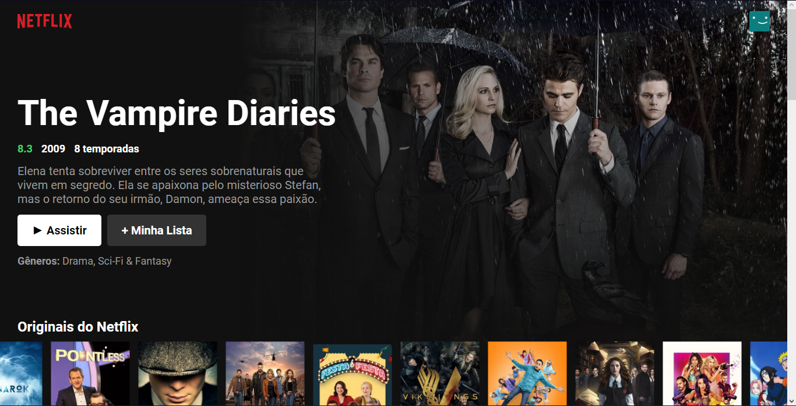

  
Done with: https://www.youtube.com/watch?v=tBweoUiMsDg (Bonieky Lacerda)

  
❓ What is this?
- A Netflix home clone with React.

  
⚙️ Used technologies:
- NodeJS.
- ReactJS.

  
🔧 Setup:
- Clone this repository: 
`git clone https://github.com/z3ox1s/netflix-clone` or Download ZIP and unzip;  
- Move to repository: 
`cd netflix-clone`  
- Install all NodeJS dependencies: 
`npm install` or `yarn install`  
- Run: 
`npm start` or `yarn start`  

📖 Dependencies:
- <a href="https://nodejs.org">NodeJS</a>
